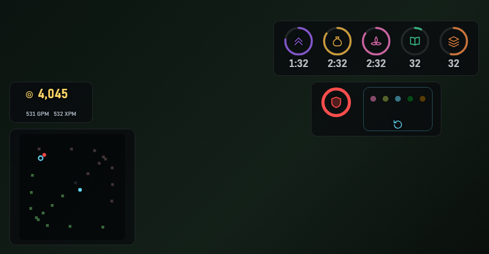

<h1> dota2-game-helper2</h1>

**English** · [简体中文](README.zh-CN.md)

[](https://github.com/shizzhang0/dota2-game-helper2/actions/workflows/ci.yml)
[](LICENSE)


A desktop overlay built on Dota 2's official GSI (Game State Integration) interface.
Hold **Alt** in game to see the timers the client never draws.

**Why this exists**: bounty runes, Lotus, the Wisdom rune, enemy glyph and enemy
buyback are not shown anywhere in the client — you are expected to keep them in your
head. But that information is **already in the data the game pushes to you**; it just
isn't drawn on screen. So draw it. No memory reading, no file changes, no simulated
input; only data the game pushes on its own, that you can already see
([why this is safe](#why-this-is-safe)).



<sub>Top left: net worth / GPM / XPM. Bottom left: the ward map (cyan = yours,
purple = enemy, hollow = sentry, amber = expiring within 60s). Top right: the timers.
Bottom right: enemy glyph and buyback. The background is a placeholder colour from the
replay tool, not an actual game frame.</sub>

## Quick start

1. Download the archive from
   [Releases](https://github.com/shizzhang0/dota2-game-helper2/releases) and unpack it
   anywhere — there is no installer, just an exe
2. Add `-gamestateintegration` to Dota 2's launch options
3. Run the game in **borderless windowed** mode (under exclusive fullscreen no
   non-injecting overlay can display at all — a system-level limitation)
4. Double-click `dota2-game-helper2.exe`; it sits in the notification area. The GSI
   config file is written automatically on first run
5. Get into a match and **hold Alt**

To move things around, resize, or turn items off: right-click the tray icon →
"Edit panel" (or press `Ctrl+Alt+F10`).

> If the panel never appears, re-check steps 2 and 3 first, then look at the logs in
> `%APPDATA%\dev.dota2helper2.app\logs\`.

## Features

| Item | Detail |
|---|---|
| Mid rune timeline | 0:00 Bounty → 2:00 / 4:00 Water → Power runes every 2 min from 6:00 |
| Bounty runes | Every 3 minutes |
| Wisdom rune | Every 7 minutes from 7:00 |
| Lotus | Every 3 minutes from 3:00 |
| Stack window | Neutrals spawn each full minute; counts down to the stacking window |
| Enemy glyph | Cooldown / ready, including the full "resets on losing the first T1/T2/T3/melee barracks" rule |
| Enemy buyback | Each enemy player's buyback cooldown (480s) — the game only announces the moment, this keeps the state |
| Economy | Your own net worth (approximate) / GPM / XPM |
| Ward map | Expiry countdown and deward alerts for your wards; enemy wards show position only |

In game there is exactly one interaction: **hold Alt to show, release to hide.**
The rest of the time the screen is untouched.

Every item can be switched off individually in settings.

### Why enemy wards have no countdown

An enemy ward is only visible during the seconds a sentry lights it up, so **there is
no way to know when it was placed** — it might be brand new, or ten seconds from
expiring. A countdown that can be five minutes too high misleads decisions, while
"there is a ward there" is already enough to act on (don't walk through / go dewarders).

## Why this is safe

This project is a **pure receiver**:

- ❌ Does not read game memory, modify game files, inject into the process, hook
  graphics APIs, or simulate any input
- ✅ Only receives data the game **pushes on its own** through GSI — data that is
  **already visible to you**

GSI is an interface Valve exposes officially (the same mechanism Logitech and Razer
drivers use). During a match it only pushes the local player's own data, so by design
it cannot be used to obtain hidden information. Alt detection passively polls keyboard
state; it registers no hotkey and intercepts no keystrokes.

## Settings

The app lives in the notification area (system tray). Its right-click menu has two
entries only:

```
Edit panel      ← left-clicking the icon does the same
──────────
Quit
```

**"Edit panel" enters edit mode** (hotkey `Ctrl+Alt+F10`): the four blocks — **timers /
enemy / net worth / ward map** — are forced visible and can each be dragged where you
want them, and a settings card floats up alongside: display toggles, language, panel
scale, overall opacity, backdrop opacity, ward map size, reset, ward map legend, log
level, and match recording. Changes apply immediately, no restart. The card itself can
be dragged too — grab its title bar.

Settings and layout share one mode for a reason: the panel is normally hidden, so if
settings were a separate window, adjusting scale and opacity would be flying blind.

In edit mode the overlay takes over the whole screen for mouse input (otherwise the
blocks could not be dragged), so there are three ways out: **the "Done" button on the
card · ESC · pressing `Ctrl+Alt+F10` again**.

> ESC is handled by the frontend rather than registered as a global hotkey — that
> would hijack the in-game menu key.

Config files all live in `%APPDATA%\dev.dota2helper2.app\`:

| | |
|---|---|
| `constants/` | Timing tables, item prices, price overrides, language packs — edit the JSON and restart |
| `settings.json` | The settings above |
| `layout.json` | Position of each of the four blocks |
| `logs/` | Runtime logs |
| `records/` | Match recordings (off by default) |

### Uninstalling

There is no installer, so there is nothing to uninstall — delete three things:

1. `dota2-game-helper2.exe`
2. the config directory `%APPDATA%\dev.dota2helper2.app\`
3. `gamestate_integration_helper2.cfg` in Dota's
   `game\dota\cfg\gamestate_integration\` directory

## Tech stack

- Shell: [Tauri 2](https://tauri.app/) (Rust) — transparent, undecorated, always-on-top,
  click-through window
- Frontend: vanilla JS + SVG, no framework
- Data source: Dota 2 GSI (local HTTP push)
- Item prices: local constants (snapshot from [OpenDota](https://docs.opendota.com/))
  plus an override table — **no network access at runtime**

All timing constants live outside the binary in `constants/*.json` (one table each for
normal and turbo), so a game patch means editing data, not code.

**Item prices are editable too.** The price table is a local constant
(`constants/item_prices.json`, refreshed per patch with `python tools/fetch_prices.py`)
and the program makes no network requests while running. Since OpenDota lags behind the
game (measured: the game charges 5200 for Heart while OpenDota still says 5100),
`constants/item_price_overrides.json` lets you override any item as
`"item name": actual price`, effective on restart. When net worth is off by exactly one
item's cost, add a line there — delete it once upstream catches up, and the log will
point out which overrides have become redundant.

## Development

```bash
cargo build --release --manifest-path src-tauri/Cargo.toml   # build
python tools/replay.py                                       # replay server
```

With the replay server up, open <http://127.0.0.1:8000/dev.html> to drive the frontend
from a real dump instead of repeatedly launching the game. `?file=` picks the file,
`?speed=` changes playback rate; in the page, `v` forces the panel visible, `e` toggles
edit mode, `b` cycles the background. Recorded `.jsonl.gz` files can be fed straight in,
including ones truncated by a hard kill.

Design notes live in [docs/design/](docs/design/), organised by topic:
[timers](docs/design/timers.md) · [net worth](docs/design/networth.md) ·
[ward map](docs/design/wards.md) · [app shell](docs/design/overlay.md) ·
[dev tools](docs/design/dev-tools.md); unfinished work is in
[docs/backlog.md](docs/backlog.md) and open verification items are in
[docs/verify-checklist.md](docs/verify-checklist.md). **Those are development notes
and are kept in Chinese only.**

**The frontend is embedded into the binary at compile time**, so changes under `ui/`
require a fresh `cargo build` to take effect (`build.rs` watches `ui/` and `icons/`, so
nothing else is needed).

Every push and PR runs a frontend syntax check plus `cargo build --release` on GitHub
Actions (see `.github/workflows/ci.yml`) — a typo under `ui/` only surfaces at compile
time, and day-to-day development goes through the replay server, which never compiles.

Test on real hardware with a **release** build: debug builds carry a console window
that cannot be closed (`windows_subsystem = "windows"` only applies in release).

When something goes wrong, start with `%APPDATA%\dev.dota2helper2.app\logs\` — release
builds have no console and cannot open devtools, so frontend exceptions are forwarded
to Rust and written into the same log.

## Licence

[MIT](LICENSE)

This project is not affiliated with Valve. Dota 2 is a trademark of Valve Corporation.

## References

- [nocamles/dota2_amount_plugins](https://github.com/nocamles/dota2_amount_plugins) —
  GSI cache pool and net worth approach
- The predecessor [dota2-game-helper](https://github.com/shizzhang0/dota2-game-helper)
  (archived) — source of the voice-prompt approach and of the lesson about hardcoding
  constants
