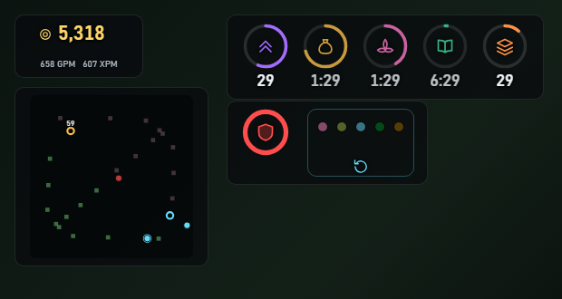
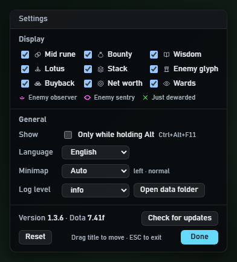

<div align="center">


# dota2-game-helper2

**Runes, buybacks, glyph, wards — what Dota 2 knows but never shows, on its own HUD**

**English** · [简体中文](README.zh-CN.md)

**[▶ Try it in your browser](https://shizzhang0.github.io/dota2-game-helper2/)** — that's the real overlay running on the page

[](https://github.com/shizzhang0/dota2-game-helper2/actions/workflows/ci.yml) [](LICENSE)  

</div>

**When the bounty runes, lotus and Wisdom Shrines come up, how long until the enemy glyph is
back, everyone's buyback cooldown — teammates included — and enemy wards that have left
vision: Dota 2 shows none of it. You are expected to keep it in your head.**

All of it is **already in the data the game sends you**; it just isn't drawn. This draws
it — **right on the game's own HUD**: buyback under each player's portrait, wards on the
minimap. No extra window.

Built on Dota 2's official GSI interface: no memory reading, no game file changes, no
simulated input ([why this is safe](#why-this-is-safe)).



<sub>A real in-game screenshot: buyback under each portrait, enemy glyph at the enemy end
of the top bar, the five timers below the game clock, net worth next to the kill counter,
enemy wards on the minimap. Game imagery © Valve.</sub>

## Up and running in three minutes

Windows 10 / 11.

1. Download the **[installer](https://github.com/shizzhang0/dota2-game-helper2/releases/latest/download/dota2-game-helper2-setup.exe)** and run it
   (current user only, no admin rights needed). There's also a
   [portable zip](https://github.com/shizzhang0/dota2-game-helper2/releases/latest/download/dota2-game-helper2-portable.zip) with a single exe, but
   it doesn't get one-click updates. Older versions are on [Releases](https://github.com/shizzhang0/dota2-game-helper2/releases)
2. Add `-gamestateintegration` to Dota 2's launch options
3. Run the game in **borderless window** mode
4. Start it. It lives in the notification area and sets up the GSI config on first run
5. Get into a match — it's there

Nothing to position: it lines itself up with the game's HUD and follows resolution changes.
To turn items on or off: **left-click the tray icon**, or right-click → Settings.

> **Never shows up?** Check steps 2 and 3 first — no external overlay can draw over
> exclusive fullscreen; that's an OS limitation. Then look at the logs in
> `%APPDATA%\dev.dota2helper2.app\logs\`.

## What it keeps track of

### Timers


| | Normal | Turbo |
|---|---|---|
| Mid rune | Water runes at 2:00 / 4:00; power runes every 2 min from 6:00 (the first bounty runes spawn in the river at 0:00) | Same |
| Bounty runes | Every 4 min | Same |
| Wisdom Shrine | Every 7 min from 7:00 | Same |
| Lotus | Every 3 min from 3:00 | **Every 90s from 1:30** |
| Stacking | Neutrals spawn on the minute; counts you down to it | Same |

Turbo is detected automatically. A row of small rings sits below the game clock, and
**the ring is the progress bar**: nearly empty means nearly up, and it thickens for the
last 10 seconds.

### Buyback and enemy glyph


**Buyback**: all ten players' buyback cooldowns, each under that player's portrait — a
small pile of coins plus the seconds left, shown only while on cooldown. The game
announces an enemy buyback once and then it's gone; **a teammate's buyback cooldown isn't
shown anywhere** (the gold bar under the portrait only says whether they can buy back now).

**Enemy glyph**: at the enemy end of the top bar, with the seconds left in the centre while
on cooldown, lit up when ready. Losing the first T1, the first T2 or the first melee
barracks refreshes it, and that's all accounted for — it shows whether the enemy **has a
glyph right now**, not just when they last used one.

### Net worth


Net worth, GPM and XPM, next to the kill counter at the top left. Net worth = items +
stash + ward dispenser + items in transit on the courier + gold.

> Net worth is an **approximation**: GSI only sends your own inventory, so items on the
> ground or held by a teammate can't be counted.

### Wards


Three things the native minimap doesn't show, drawn straight onto it:

| | Looks like | The native minimap |
|---|---|---|
| Enemy ward | a **magenta** eye shaped like the game's: with a pupil = observer, hollow lens = sentry | Only shows it while true sight is on it; here it **stays after it leaves vision**, fading the longer it goes unseen and disappearing at the end of its lifetime |
| Your ward dewarded | a **green cross** on the spot, fading out over 45s | The ward just vanishes — expired or killed, you can't tell |
| Your ward expiring | the seconds left above the ward for its last 60s, amber for the last 10 | Doesn't show how long is left |

Whether your minimap is on the left or right and whether it's extra large is **read from
Dota's own settings** — nothing to line up by hand.

## Want a clean screen? Make it hold-Alt only

By default it stays up throughout a match and disappears back in the main menu.

Rather not have it there all the time? Tick **Only while holding Alt** in the settings, and
it only appears while you hold Alt. To tuck it away mid-match, press **`Ctrl+Alt+F11`** —
it flips the same setting.

Alt is only read passively; no input is intercepted, so Alt works in-game exactly as before.

## What's supported

| | |
|---|---|
| Game modes | Ranked / unranked / Turbo |
| Spectating · replays | Hidden (GSI sends everyone's data then, which would make net worth and buyback wrong) |
| UI languages | English · 简体中文 |

## Settings

**Left-click the tray icon** (or right-click → Settings, or press `Ctrl+Alt+F10`) to open
the settings card. The whole overlay shows while it's open, so you can check against the
game that everything lines up.



| | |
|---|---|
| **Display** | A toggle for each of the nine items; the icons double as the legend |
| **Show** | "Only while holding Alt" — see above |
| **Minimap** | "Auto" by default, followed by what it read from Dota's settings; pick it by hand if that's wrong |
| **Log level · Open data folder** | For bug reports |
| **Version** | **NEW** appears next to it when there's an update |

Changes apply immediately. Clicks outside the card still reach the game, and the card can
be dragged out of the way by its title bar. To close it: press Done, or `Ctrl+Alt+F10` again.

Settings and logs live in `%APPDATA%\dev.dota2helper2.app\`.

### Upgrading

When there's a new version, **NEW** appears next to the version on the settings card and
the tray menu gains an "Update available" item.

- **Installed**: press Update now — download, install and restart happen on their own
- **Portable**: press Download page for the new zip, quit the app (right-click the tray
  icon → Quit), then overwrite the old exe

Your settings survive upgrades. Moving from a 1.3.x portable exe to the installer: install,
then delete the old exe.

### Uninstalling

- **Installed**: uninstall from Windows Settings → Apps; the GSI config in the Dota folder
  is removed with it. Settings and logs are only removed if you tick the option to delete
  application data
- **Portable**: delete the exe, `%APPDATA%\dev.dota2helper2.app\`, and Dota's
  `game\dota\cfg\gamestate_integration\gamestate_integration_helper2.cfg`

## Why this is safe

| What it does **not** do | What it does |
|---|---|
| ❌ Read game memory | ✅ Receive the data the game itself sends to `127.0.0.1:53000` |
| ❌ Modify game files | ✅ Write one GSI config file (the mechanism Valve built for this) |
| ❌ Inject into the process / hook graphics APIs | ✅ Be an ordinary transparent always-on-top window |
| ❌ Simulate any input | ✅ Passively read the Alt key state |
| ❌ Phone home | ✅ Ask GitHub for a newer version on startup and when you press Check for updates, sending no personal data; download only when you press Update now |

It also **reads** Dota's own settings file under Steam's `userdata` to find the minimap's
side and size.

GSI is an official Valve interface; Logitech and Razer drivers use it too. **During a match
it only sends what you can already see** — anything this overlay works out, you could see
yourself by pressing Tab. It just remembers the timing for you. The source is open; check it.

## Development

[Tauri 2](https://tauri.app/) (Rust) + plain JS / SVG — no front-end framework, no build step.

```bash
cargo build --release --manifest-path src-tauri/Cargo.toml   # build
python tools/replay.py                                       # replay server: drive the UI from a recording
python tools/sync_constants.py                               # sync the price table after a Dota patch
```

**Recording match data**: add `"devTools": true` to `%APPDATA%\dev.dota2helper2.app\settings.json`
and restart. A Developer section appears at the bottom of the settings card; tick "Record
match data". Recordings go to `records\` in the same folder, one file per match, and can be
fed straight to the replay server.

Dev tools, the release process and the design behind each feature are in
[docs/design/](docs/design/) (Chinese only).

## Licence

[MIT](LICENSE)

Not affiliated with Valve. Dota 2 is a trademark of Valve Corporation.

## Credits

- [nocamles/dota2_amount_plugins](https://github.com/nocamles/dota2_amount_plugins) — the GSI cache-pool and net-worth approach
- The predecessor [dota2-game-helper](https://github.com/shizzhang0/dota2-game-helper) (archived)
