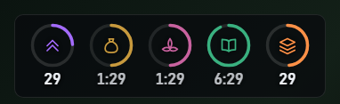
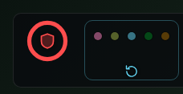
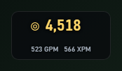
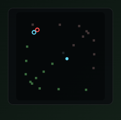
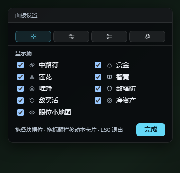
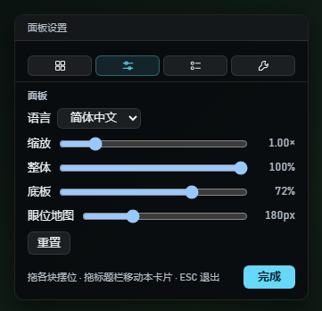
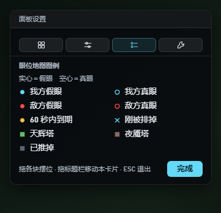
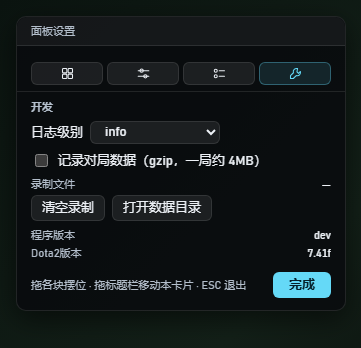

<div align="center">


# dota2-game-helper2

**按住 Alt，看见 Dota 2 不显示的那些计时**

[English](README.md) · **简体中文**

**[▶ 在浏览器里试试](https://shizzhang0.github.io/dota2-game-helper2/)** — 页面上跑的就是真覆盖层

[](https://github.com/shizzhang0/dota2-game-helper2/actions/workflows/ci.yml) [](LICENSE)  

</div>

**赏金符、莲花、智慧神符、敌方塔防和买活的计时，Dota 2 客户端里哪儿都不显示，
只能靠自己记。**

但这些信息**本来就在游戏推给你的数据里**，只是没画在屏幕上——那就把它画出来。

这是一个基于 Dota 2 官方 GSI 接口的桌面覆盖层：平时屏幕上什么都没有，
**按住 Alt** 才浮出来。不读内存、不改文件、不模拟输入，只接收游戏主动推送的、
本来就对你可见的数据（[为什么这是安全的](#为什么这是安全的)）。


<sub>左上是净资产 / GPM / XPM，左下是眼位小地图，右上是各类倒计时，
右下是敌方塔防与买活。这张图和下面所有截图都由
[`tools/make_shots.py`](tools/make_shots.py) 用真实录制的对局数据生成，
跑的是和正式版同一份前端代码。背景是占位色，不是真实游戏画面。</sub>

## 三分钟上手

1. 在 [Releases](https://github.com/shizzhang0/dota2-game-helper2/releases) 下载压缩包，
   解压到任意目录——**没有安装程序，就一个 exe**
2. 给 Dota 2 的启动项加上 `-gamestateintegration`
3. 游戏用**无边框窗口**模式
4. 双击 `dota2-game-helper2.exe`，它会常驻通知区。首次运行自动写入 GSI 配置文件
5. 进对局，**按住 Alt**

就这样。想调位置和显示项：右键通知区图标 →「编辑面板」（或 `Ctrl+Alt+F10`）。

> **面板一直不出现？** 先确认第 2、3 步——独占全屏下任何非注入类悬浮层都无法显示，
> 这是系统级限制，不是程序的问题。再看
> `%APPDATA%\dev.dota2helper2.app\logs\` 里的日志。

## 它替你记的那些事

### 五个倒计时：符、莲花、智慧、堆野



| 项目 | 规则 |
|---|---|
| 中路符 | 0:00 赏金 → 2:00 / 4:00 圣水 → 6:00 起每 2 分钟强化符 |
| 赏金符 | 每 3 分钟 |
| 莲花 | 3:00 起每 3 分钟 |
| 智慧神符 | 7:00 起每 7 分钟 |
| 堆野 | 野怪每整分钟刷新，倒数提醒 |

图标压在环里、数字在环下面。**环快走完 = 快刷了**，不用读数字也能扫一眼知道。

### 敌方还剩什么：塔防与买活



**塔防**不只是个冷却计时。Dota 的规则是"丢掉首座 T1 / T2 / T3 / 近战兵营时各刷新一次"，
程序把这套规则完整实现了——所以它知道敌方现在到底有没有塔防可用，
而不只是知道上一次用在什么时候。

**买活**是游戏只在瞬间播报、过后就查不到的信息。这里把五个敌人各自的
480 秒冷却保留成状态：**亮着的圆点 = 那个人现在买不起活**。

### 你的经济



净资产（装备 + 储藏处 + 眼架 + 信使在途 + 金钱）、GPM、XPM。

> 净资产是**近似值**。GSI 只推自己的物品栏，掉在地上的、队友代拿的都看不见；
> 消耗品按剩余充能折价、吞噬类 buff（魔晶、神杖、月之碎片）按吃掉的物品计入。
> 口径和已知误差都记在 [design/networth.md](docs/design/networth.md) 里。

### 眼位地图



**颜色说归属，形状说状态**——两条互不干扰的通道：

| 通道 | 取值 |
|---|---|
| 颜色 | 青 = 我方 · 红 = 敌方 · 琥珀 = 60 秒内到期 |
| 形状 | 实心圆 = 假眼 · 空心圈 = 真眼 · **叉 = 刚被排掉** |

上图里青色空心圈和红色空心圈并排——同样是真眼，一个是你的，一个是敌人的。

底图只画塔（绿=天辉、暗红=夜魇、灰=已推掉），**刻意画得很淡**：塔是参照物，
眼才是你要看的东西。

#### 敌方眼为什么不带倒计时

只有真眼照到的那十几秒里才看得见敌方的眼，**根本无从得知它是什么时候插的**——
可能刚插，也可能还剩十秒。一个可能虚高五分钟的倒计时会误导决策，
而"那里有眼"这一条信息本身就够用了（别从这走 / 去排掉它）。

不过**记忆会随时间变淡**：越久没再确认过的敌方眼画得越透明。它到了名义寿命
就自动消失，不会永远挂在地图上骗你。

## 平时它不在

游戏中的交互只有一种：**按住 Alt 显示，松开隐藏。** 不按的时候屏幕上什么都没有，
不占地方、不挡视野、不需要你去关掉它。

Alt 是被动检测的（轮询键盘状态），**不注册热键、不拦截按键**，
所以游戏内 Alt 的原有功能（Alt 点地图等）完全不受影响。

### 支持情况

| | |
|---|---|
| 系统 | Windows 10 / 11 |
| 显示模式 | 无边框窗口 ✅ · 独占全屏 ❌（系统级限制，非注入类悬浮层都不行） |
| 游戏模式 | 天梯 / 匹配 / 快速组队都支持，时间表自动切换 |
| 观战 · 看回放 | **整窗隐藏**（刻意如此，见下） |
| 界面语言 | 简体中文 · English |

> **观战和看回放时为什么整个藏起来**：那两种情况下 GSI 推的是全员数据，
> 净资产和敌方买活这两块算出来是错的，而符和眼位反而更全。
> 半开的面板会让人以为程序坏了，所以干脆全藏——这个覆盖层要解决的是
> **你正在打的那一局**里游戏不告诉你的事，而观战本来就有一堆现成工具。

## 调成你想要的样子

右键通知区图标 →「编辑面板」（或 `Ctrl+Alt+F10`）进入编辑态：四个块
**倒计时 / 敌方 / 净资产 / 眼位地图**强制常显、各自可以拖到想要的位置，
同时浮出一张设置卡片。卡片分四页，按图标切换：

|  |  |
|---|---|
|  |  |
| **显示项** — 九个格子各自的开关 | **面板** — 语言、缩放、透明度、底板、地图大小、重置 |
|  |  |
| **图例** — 地图上各种颜色和形状的含义 | **开发** — 日志级别、对局录制、数据目录、版本号 |

改动即时生效，不需重启。卡片自己也能拖，抓它顶部的标题栏。

> **设置和摆位为什么在同一个状态里**：面板平时藏着，
> 如果设置做成独立窗口，调缩放和透明度就成了盲调。

编辑态下覆盖层会接管整屏鼠标（否则拖不动块），所以退出留了三条路：
**卡片上的「完成」按钮 · ESC · 再按一次 `Ctrl+Alt+F10`**。

> ESC 是前端监听的，没有注册成全局热键——那样会劫持游戏内的菜单键。

### 文件都放在哪

全部在 `%APPDATA%\dev.dota2helper2.app\`：

| | |
|---|---|
| `constants/` | 时间常数表 + 语言包，**改 JSON 重启即生效**（物品价格表不在这里，见下） |
| `settings.json` | 上面那些设置 |
| `layout.json` | 四个块各自的位置 |
| `logs/` | 运行日志（超过 5MB 轮转，只留一个备份） |
| `records/` | 对局录制（默认关闭） |

### 卸载

没有安装包，也就没有卸载程序——删三样东西即可：

1. `dota2-game-helper2.exe`
2. 配置目录 `%APPDATA%\dev.dota2helper2.app\`
3. Dota 的 `game\dota\cfg\gamestate_integration\` 里那个
   `gamestate_integration_helper2.cfg`

## 为什么这是安全的

本项目是**纯接收器**。这不是一句保证，而是一条可以逐项核对的清单：

| 它**不**做 | 它做什么 |
|---|---|
| ❌ 读游戏内存 | ✅ 在 `127.0.0.1:53000` 上收游戏自己 POST 过来的 JSON |
| ❌ 修改游戏文件 | ✅ 只写一个 GSI 配置文件（Valve 为此设计的机制） |
| ❌ 注入进程 / hook 图形 API | ✅ 一个普通的透明置顶窗口 |
| ❌ 模拟任何输入 | ✅ 被动轮询 Alt 的按键状态 |
| ❌ 运行时联网 | ✅ 所有常数都在本地，装完就能断网用 |

GSI 是 Valve 官方暴露的接口，罗技、雷蛇的驱动用的是同一套机制。
**它在对局中只推送玩家本人的数据**，设计上就无法用于获取隐藏信息——
这个覆盖层能算出来的，你自己按 Tab 一样能看到，只是它替你记住了时间。

源码全部公开，[GSI 配置文件写了什么](src-tauri/src/gsicfg.rs)、
[收到的数据怎么处理](ui/js)，都可以自己核。

## 它是怎么跑起来的

```
Dota 2  ──GSI (HTTP POST)──▶  127.0.0.1:53000
                                    │
                    ┌───────────────┴───────────────┐
                    │  Rust / Tauri 2               │
                    │  gsi · altkey · gsicfg        │  收包、轮询 Alt、写配置
                    │  constants · settings · log   │  常数播种、设置、日志
                    └───────────────┬───────────────┘
                                    │  事件
                    ┌───────────────┴───────────────┐
                    │  前端 vanilla JS + SVG        │
                    │  cachepool → match            │  合并增量包、切分对局
                    │    → timers   倒计时（纯函数） │
                    │    → events   塔防 / 买活状态机│
                    │    → networth 净资产          │
                    │    → minimap  眼位            │
                    │    → render   四个块          │
                    └───────────────┬───────────────┘
                                    ▼
                     透明 · 置顶 · 鼠标穿透的整屏窗口
                          （按住 Alt 才可见）
```

- 壳：[Tauri 2](https://tauri.app/)（Rust）
- 前端：vanilla JS + SVG，**无框架、无构建步骤**，编译期直接嵌进二进制
- 数据源：Dota 2 GSI（本地 HTTP 推送）
- 物品价格：本地常数表，快照取自**游戏本体自己的数据文件**

### 常数为什么外置

时间表（正常 / 快速两套）和语言包都在 `constants/*.json`，版本更新只改数据不改代码。
**上一个项目正是死于把常数写死在代码里**，Dota 一改间隔就静默失效。

这份常数对齐到哪个 Dota 版本写在 `constants/patch.json` 里，也就是顶上那枚徽章：

```json
{ "dota": "7.41f", "synced": "2026-09-16" }
```

**价格表是个例外，它不落到配置目录**，只编译进程序。价格由
`python tools/sync_constants.py` 从游戏自己的文件生成（`items.txt` 的 `ItemCost`、
`npc_ability_ids.txt` 的物品 id）。这是**开发机上的一步**——发布出去的 exe
里没有这段解析，也不会去翻 Dota 的安装目录。

代价是补丁刚出而这边还没发版的那几天只能等。换来的是不会出现
**"盘上那份旧表静默盖住新表"**——那比价格晚几天更难发现。时间表不受此限，仍然可改。

## 开发

```bash
cargo build --release --manifest-path src-tauri/Cargo.toml   # 构建
python tools/replay.py                                       # 回放服务器
python tools/sync_constants.py                               # 跟随 Dota 版本更新常数
python tools/make_shots.py                                   # 重新生成 README 截图
python tools/make_demo.py <录制> --from 60 --to 460           # 生成站点 demo 数据
```

**回放服务器**起好后开 <http://127.0.0.1:8000/dev.html>，用真实 dump 驱动前端，
不必反复进游戏。`?file=` 选文件、`?speed=` 调倍速、`?demo=` 换成静态文件回放；
页面内 `v` 常显、`e` 编辑态、`b` 换背景。录制出来的 `.jsonl.gz` 可以直接喂给它，
被强杀而截断的文件也能读。

**Dota 更新后**跑一次 `sync_constants.py`：它从本机 Dota 的 VPK 重新生成价格表、
更新版本号和两份 README 的徽章，并打印两样东西——价格相对上一版的差异，
以及这一版更新日志里命中符 / 肉山 / 塔防 / 买活 / 莲花 / 堆野等机制的条目。
价格是自动的；那些条目要人读一遍，据此决定要不要动 `normal.json` / `turbo.json` /
`towers.json`——符刷新间隔这类东西不在游戏的物品表里。

**前端是编译期嵌入二进制的**，改完 `ui/` 下的文件必须重新 `cargo build` 才生效
（`build.rs` 会盯着 `ui/` 和 `icons/`）。每次 push 与 PR 都会在 CI 上跑一遍前端语法检查
和 `cargo build --release`——`ui/` 下写错一个字符只有真正编译时才暴露，
而日常开发看的是回放服务器，那条路不经过编译。

**实机测试用 release 构建**：debug 版会带一个关不掉的控制台窗口
（`windows_subsystem = "windows"` 只在 release 生效）。出问题先看
`%APPDATA%\dev.dota2helper2.app\logs\`——正式版没有控制台也开不出 devtools，
前端异常会转发给 Rust 一起写进日志。

设计文档按主题组织在 [docs/design/](docs/design/)：
[倒计时](docs/design/timers.md) · [净资产](docs/design/networth.md) ·
[眼位小地图](docs/design/wards.md) · [程序外壳](docs/design/overlay.md) ·
[开发工具](docs/design/dev-tools.md)；未完成事项见
[docs/backlog.md](docs/backlog.md)，待验证事项见
[docs/verify-checklist.md](docs/verify-checklist.md)。
**这些是开发笔记，只有中文。**

## 许可

[MIT](LICENSE)

本项目与 Valve 无关联。Dota 2 是 Valve Corporation 的商标。

## 参考

- [nocamles/dota2_amount_plugins](https://github.com/nocamles/dota2_amount_plugins) — GSI 缓存池与净资产计算思路
- 前作 [dota2-game-helper](https://github.com/shizzhang0/dota2-game-helper)（已归档）— 语音提示方案与常数硬编码的教训来源
