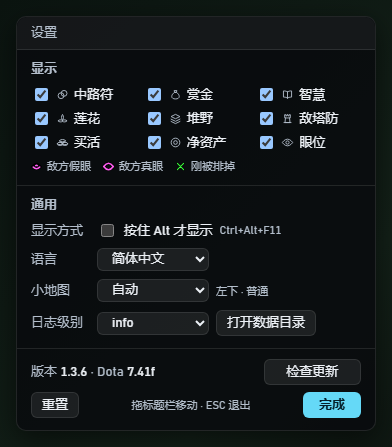

<div align="center">


# dota2-game-helper2

**符、买活、塔防、眼位——游戏知道却不显示的，补到它的界面上**

[English](README.md) · **简体中文**

**[▶ 在浏览器里试试](https://shizzhang0.github.io/dota2-game-helper2/)** — 页面上跑的就是真覆盖层

[](https://github.com/shizzhang0/dota2-game-helper2/actions/workflows/ci.yml) [](LICENSE)  

</div>

**赏金符、莲花、智慧神龛什么时候刷，敌方塔防还要多久，队友和敌人的买活冷却，
离开视野的敌方眼——Dota 2 客户端里哪儿都不显示，只能靠自己记。**

这些信息其实**都在游戏推给你的数据里**，只是没画出来。这个程序把它们画出来，
而且**就画在游戏自己的界面上**：买活挂在各人头像底下，眼位画在小地图上，不另开窗口。

基于 Dota 2 官方的 GSI 接口：不读内存、不改游戏文件、不模拟输入
（[为什么这是安全的](#为什么这是安全的)）。


<sub>实际游戏画面：买活在每个人的头像底下，敌方塔防在对面那一端，五个倒计时在计时牌正下方，
净资产在左上角击杀数旁边，敌方眼画在小地图上。游戏画面 © Valve。</sub>

## 三分钟上手

需要 Windows 10 / 11。

1. 下载 **[安装版](https://github.com/shizzhang0/dota2-game-helper2/releases/latest/download/dota2-game-helper2-setup.exe)** 并安装
   （只装给当前用户，不要管理员权限）。也可以下 [便携版 zip](https://github.com/shizzhang0/dota2-game-helper2/releases/latest/download/dota2-game-helper2-portable.zip)，
   解压出来就一个 exe，但没有一键更新。历史版本在 [Releases](https://github.com/shizzhang0/dota2-game-helper2/releases)
2. 给 Dota 2 的启动项加上 `-gamestateintegration`
3. 游戏用**无边框窗口**模式
4. 运行它，它会常驻通知区，第一次运行会自动写好 GSI 配置
5. 进对局就能看到

不用调位置：它会自己对准游戏界面，换分辨率也跟着走。
想开关某一项：**左键单击通知区图标**，或右键 →「设置」。

> **一直不出现？** 先确认第 2、3 步——独占全屏下任何外部悬浮层都显示不了，这是系统限制。
> 还不行就看 `%APPDATA%\dev.dota2helper2.app\logs\` 里的日志。

## 它替你记的那些事

### 倒计时


| | 常规模式 | 快速模式 |
|---|---|---|
| 中路符 | 2:00 / 4:00 为圣水符；6:00 起每 2 分钟刷新强化符（首组赏金符在 0:00 生成于河道） | 同常规 |
| 赏金符 | 每 4 分钟 | 同常规 |
| 智慧神龛 | 7:00 起每 7 分钟 | 同常规 |
| 莲花 | 3:00 起每 3 分钟 | **1:30 起每 90 秒** |
| 堆野 | 每整分钟刷野，倒数提醒 | 同常规 |

快速模式自动识别。一排小圆挂在计时牌正下方，**圆环就是进度条**：环快走完就是快刷了，
最后 10 秒环会变粗。

### 买活与敌方塔防


**买活**：十个人的买活冷却挂在各自头像底下，一小堆金币加剩余秒数，冷却中才出现。
敌人买活游戏只播报一下就没了；**队友的买活冷却原生界面根本不显示**
（头像下那道金条只说"现在能不能买"）。

**敌方塔防**：画在对面那一端，冷却中圆心写剩余秒数，好了就点亮。
丢掉首座 T1、首座 T2、首座近战兵营时塔防会刷新，这些都算进去了——
显示的是敌方**现在到底有没有塔防**，不只是上一次什么时候用的。

### 净资产


净资产、GPM、XPM，就在左上角击杀数旁边。净资产 = 装备 + 储藏处 + 眼架 + 信使在途 + 金钱。

> 净资产是**近似值**：GSI 只推你自己的物品栏，掉在地上的、队友帮你拿着的都算不进来。

### 眼位


下面三样原生小地图不显示，直接补在它上面：

| | 样子 | 原生小地图 |
|---|---|---|
| 敌方眼 | **品红**的眼睛，形状和游戏一样：带瞳孔的是假眼，空心柠檬形是真眼 | 只在真视照着时显示，一离开就没了；这里**离开视野后接着显示**，越久没再看到越淡，到寿命自动消失 |
| 我方眼被排 | 原地一个**绿色的叉**，45 秒内淡出 | 眼直接没了，分不出是到期还是被排 |
| 我方眼快到期 | 最后 60 秒在眼上方写剩余秒数，最后 10 秒变琥珀色 | 不显示还剩多久 |

小地图在左边还是右边、是不是特大尺寸，程序会**读 Dota 自己的设置**，不用手动对。

## 想要干净的画面：按住 Alt 才出现

默认对局中一直显示，回到主菜单就消失。

嫌它一直在？在设置里**勾上「按住 Alt 才显示」**，之后只有按住 Alt 时才出现。
对局中途想临时收起来，按 **`Ctrl+Alt+F11`**，效果和那个勾一样。

Alt 只是被动检测按键状态，不拦截按键，游戏里 Alt 原来的功能都不受影响。

## 支持情况

| | |
|---|---|
| 游戏模式 | 天梯 / 匹配 / 快速模式 |
| 观战 · 看回放 | 不显示（那时 GSI 推的是全员数据，净资产和买活会算错，干脆整个隐藏） |
| 界面语言 | 简体中文 · English |

## 设置

**左键单击通知区图标**（或右键 →「设置」，或按 `Ctrl+Alt+F10`）打开设置卡片。
打开时覆盖层会整个显示出来，可以对着游戏看位置准不准。



| | |
|---|---|
| **显示** | 九项各自的开关，旁边的图标也是图例 |
| **显示方式** | 「按住 Alt 才显示」，见上 |
| **小地图** | 默认「自动」，后面写着从 Dota 设置里读到的结果；读错了可以手动指定 |
| **日志级别 · 打开数据目录** | 报问题时用 |
| **版本** | 有新版时旁边出现 **NEW** |

改动立即生效。卡片以外的地方照样能点到游戏，卡片可以拖着标题栏挪开。
关掉卡片：点「完成」，或再按一次 `Ctrl+Alt+F10`。

设置和日志都在 `%APPDATA%\dev.dota2helper2.app\`。

### 升级

有新版时，设置卡片的版本号旁边会出现 **NEW**，托盘菜单里也会多一项「有新版本」。

- **安装版**：点「立即更新」，下载、安装、重启自动完成
- **绿色版**：点「打开下载页」下新的 zip，先退出程序（托盘右键 →「退出」），再用新 exe 覆盖旧的

设置不受升级影响。从 1.3.x 的绿色版换成安装版：装好后把原来那个 exe 删掉就行。

### 卸载

- **安装版**：在 Windows「设置 → 应用」里卸载，写进 Dota 目录的 GSI 配置会一起删掉。
  设置和日志要在卸载时勾上删除应用数据才会删
- **绿色版**：删掉 exe、`%APPDATA%\dev.dota2helper2.app\`，以及 Dota 的
  `game\dota\cfg\gamestate_integration\gamestate_integration_helper2.cfg`

## 为什么这是安全的

| 它**不**做 | 它做什么 |
|---|---|
| ❌ 读游戏内存 | ✅ 在本机 `127.0.0.1:53000` 接收游戏自己推过来的数据 |
| ❌ 修改游戏文件 | ✅ 只写一个 GSI 配置文件（Valve 为此设计的机制） |
| ❌ 注入进程 / hook 图形 API | ✅ 一个普通的透明置顶窗口 |
| ❌ 模拟任何输入 | ✅ 被动读取 Alt 键的状态 |
| ❌ 后台联网 | ✅ 只在启动时和点「检查更新」时向 GitHub 查一次新版本，不带任何个人数据；点「立即更新」才下载 |

另外会**只读** Steam `userdata` 下 Dota 自己的设置文件，取小地图的位置和大小。

GSI 是 Valve 官方提供的接口，罗技、雷蛇的驱动用的也是它。**对局中它只推送你自己能看到的数据**，
这个程序能算出来的，你自己按 Tab 一样看得到——它只是替你记住了时间。源码全部公开，可以自己核对。

## 开发

[Tauri 2](https://tauri.app/)（Rust）+ 原生 JS / SVG，无前端框架、无构建步骤。

```bash
cargo build --release --manifest-path src-tauri/Cargo.toml   # 构建
python tools/replay.py                                       # 回放服务器，用录制数据驱动前端
python tools/sync_constants.py                               # Dota 更新后同步价格表
```

**录制对局数据**：在 `%APPDATA%\dev.dota2helper2.app\settings.json` 里加上 `"devTools": true`，
重启程序，设置卡片最下面会多出「开发」一节，勾上「记录对局数据」即可。
录制存在同目录的 `records\`，一局一个文件，可以直接喂给回放服务器。

开发工具、发版流程和各功能的设计都在 [docs/design/](docs/design/)（只有中文）。

## 许可

[MIT](LICENSE)

本项目与 Valve 无关联。Dota 2 是 Valve Corporation 的商标。

## 参考

- [nocamles/dota2_amount_plugins](https://github.com/nocamles/dota2_amount_plugins) — GSI 缓存池与净资产计算思路
- 前作 [dota2-game-helper](https://github.com/shizzhang0/dota2-game-helper)（已归档）
